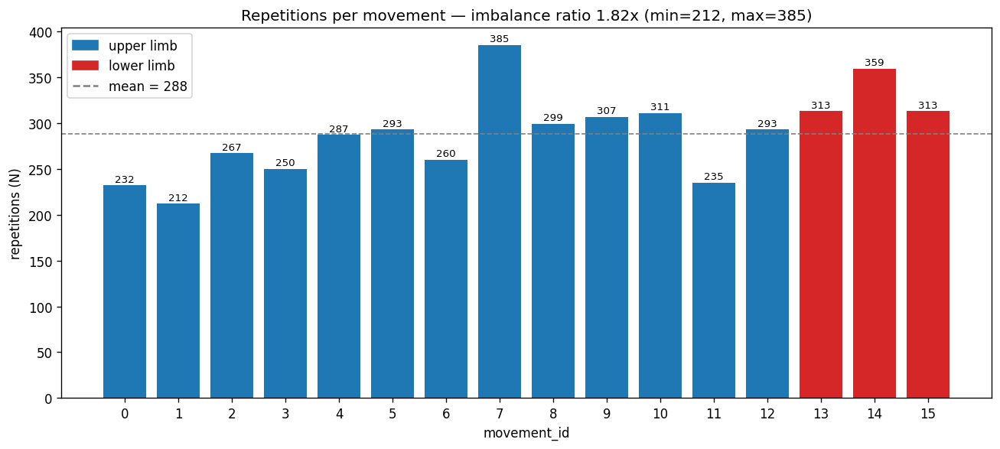
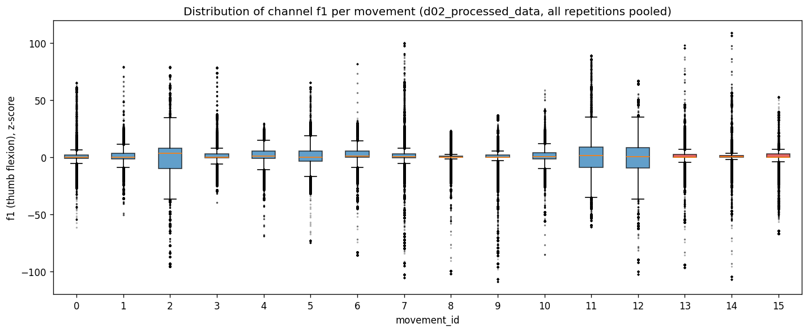
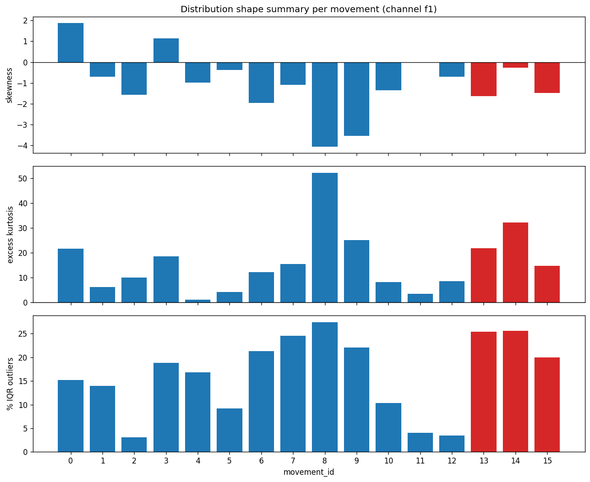
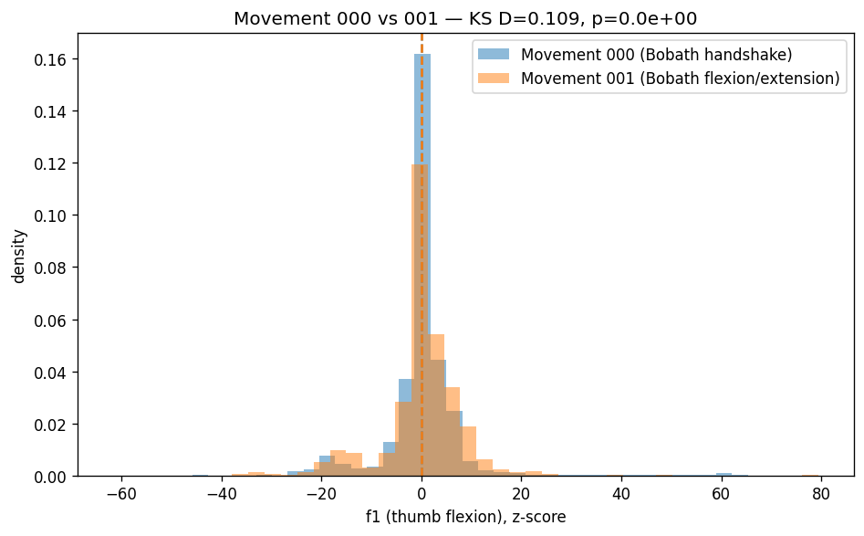
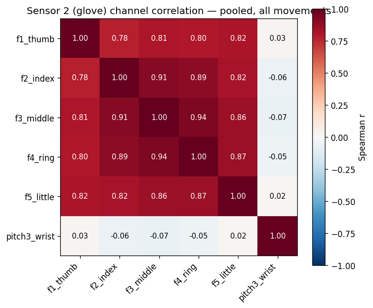
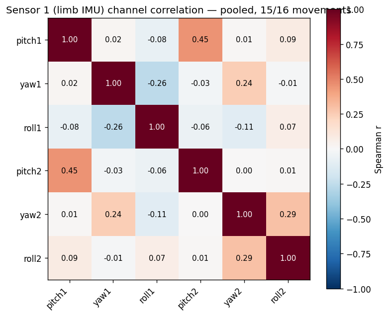
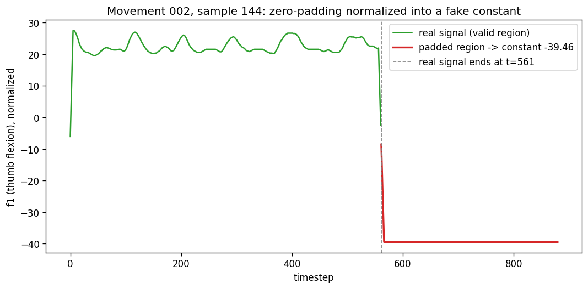

# Exploratory Data Analysis — REHAB `Rehab_exercise` Dataset

**Source notebook:** [`Activity1.ipynb`](./Activity1.ipynb)
**Figures notebook:** [`EDA_Graphs.ipynb`](./EDA_Graphs.ipynb) — generates every chart in this report (saved to [`figures/`](./figures/))
**Dataset documentation:** [`Data/README.md`](../Data/README.md), [`Data/Article.pdf`](../Data/Article.pdf)
**Related work:** [`ETL_Cleaning/`](../ETL_Cleaning/) (cleaning/transformation pipeline built from the issues this report identifies)

This report follows the three-step EDA methodology described in
*"A Data Scientist's Essential Guide to Exploratory Data Analysis"*
([Towards Data Science](https://towardsdatascience.com/a-data-scientists-essential-guide-to-exploratory-data-analysis-25637eee0cf6/)):

1. **Dataset Overview & Descriptive Statistics** — what am I working with?
2. **Feature Assessment & Visualization** — univariate, then multivariate.
3. **Data Quality Evaluation** — what's wrong with it, and how bad is it?

All numbers below were computed directly from `Data/Rehab_exercise/d02_processed_data/`
(the dataset authors' own filtered + normalized files — the same files `Activity1.ipynb`
uses) unless stated otherwise. Where a finding was already established during the ETL
audit (`ETL_Cleaning/`), it is cited rather than re-derived.

---

## Step 1 — Dataset Overview & Descriptive Statistics

### What are we working with?

This is **not** a flat feature table — there is no single row-per-observation CSV.
The unit of analysis is a **repetition** (one execution of one movement by one
patient), stored as a 3D array:

- **16 movement classes** (`movement_id` 0–15, see `Data/README.md` for the full
  library), each split across **2 sensor-group files**: `sensorID=1` (limb IMU
  pitch/yaw/roll) and `sensorID=2` (glove finger flexion + wrist pitch).
- Each file has shape **`(d, 880, 6)`**: `d` repetitions × 880 standardized
  timesteps × 6 channels. `d` varies per movement (212–385, see Table 1).
- **All features are numeric** (float64, degrees). There are no categorical
  columns, no text fields, and no separate label file — the label is the
  `movement_id` encoded in the filename.
- **Total repetitions across all 16 movements (sensor 2): 4,616** (sum of the
  `N` column in Table 1).

### Missing data and duplicates (overall rate)

- **0 `NaN` / 0 `Inf`** across all `d01_raw_data` arrays (9,232 raw samples,
  32 files) — confirmed during the ETL audit.
- **1 corrupted file**: `d02_processed_data/014_1.npy` fails to load
  (`np.load` raises `UnpicklingError` — the file contains UTF-8
  replacement-character bytes instead of valid binary data). This is why
  `Activity1.ipynb`'s sensor-alignment check (Question 6) explicitly skips
  movement `014`. See Step 3 for detail.
- **142 fully-empty repetitions** (100% zero-padding, no real signal) and
  **1,438 exact-duplicate repetitions** in the raw data — both detected and
  removed in `ETL_Cleaning/` (see that report for the detection method). They
  are **not** removed in `d02_processed_data`, which is what this EDA and
  `Activity1.ipynb` analyze.

### Descriptive statistics (Table 1)

Channel used: `f1` (thumb flexion, channel 0 of `sensorID=2`) — the same
channel `Activity1.ipynb` uses in Questions 8–11. Stats are computed by
pooling all timesteps of all repetitions of each movement.

| ID | Movement | Limb | N | Median | Std | Skew | Kurtosis | %Zero | %IQR outliers |
|---:|:---|:---|---:|---:|---:|---:|---:|---:|---:|
| 0 | Bobath handshake | upper | 232 | 0.07 | 7.44 | 1.88 | 21.68 | 0.00 | 15.20 |
| 1 | Bobath flexion/extension | upper | 212 | 0.19 | 7.82 | -0.71 | 6.24 | 3.30 | 13.92 |
| 2 | Bobath forward flexion/extension | upper | 267 | 3.17 | 15.46 | -1.57 | 10.12 | 0.37 | 3.09 |
| 3 | Bobath ant/post rotation | upper | 250 | -0.02 | 7.64 | 1.15 | 18.56 | 0.00 | 18.86 |
| 4 | Elbow flexion + wrist compression | upper | 287 | 0.77 | 8.86 | -0.98 | 1.22 | 3.83 | 16.82 |
| 5 | Wrist flexion/extension | upper | 293 | 0.00 | 9.84 | -0.37 | 4.17 | 3.07 | 9.21 |
| 6 | Finger-to-finger training | upper | 260 | 0.78 | 10.67 | -1.96 | 12.20 | 1.15 | 21.27 |
| 7 | Ball gripping | upper | 385 | 0.20 | 13.50 | -1.10 | 15.46 | 0.78 | 24.50 |
| 8 | Shoulder internal/external rotation | upper | 299 | 0.09 | 7.03 | -4.07 | 52.23 | 0.00 | 27.43 |
| 9 | Breast expansion | upper | 307 | 0.15 | 11.62 | -3.53 | 25.16 | 0.00 | 22.02 |
| 10 | Flexion-pressure rotation fwd/back | upper | 311 | 0.54 | 7.81 | -1.36 | 8.30 | 0.00 | 10.32 |
| 11 | Elbow flexion and touch | upper | 235 | 1.63 | 16.22 | -0.04 | 3.44 | 6.81 | 4.06 |
| 12 | Shoulder touch training | upper | 293 | 0.61 | 14.37 | -0.71 | 8.65 | 4.44 | 3.51 |
| 13 | Ankle ext. & knee int/ext rotation | lower | 313 | 0.16 | 9.61 | -1.63 | 21.83 | 1.28 | 25.36 |
| 14 | Knee flexion/extension | lower | 359 | 0.21 | 8.44 | -0.28 | 32.10 | 0.00 | 25.62 |
| 15 | Hip flexion/extension | lower | 313 | 0.19 | 8.28 | -1.49 | 14.73 | 0.32 | 19.93 |

*(Mean is omitted: it is ≈1e-15 for every movement by construction, since
`d02_processed_data` is already zero-mean normalized per sample — see Step 3
for why this makes the mean uninformative here.)*

---

## Step 2 — Feature Assessment & Visualization

### 2.1 Univariate Analysis

**Distribution shape.** Every movement's `f1` distribution is leptokurtic
(kurtosis 1.2–52.2, all far above the Gaussian value of 0) and mostly
left-skewed (13 of 16 movements have negative skew). This is expected, not a
data defect: a flexion-angle channel spends most of its time near a resting
position and only swings to an extreme during the active phase of the
repetition — the distribution is fundamentally **bimodal** (resting vs.
flexed), not unimodal-with-outliers.

**Outliers — important caveat.** The IQR rule (`Activity1.ipynb` does not
compute this; added here to complete the methodology's Step 2 requirement)
flags 3–27% of points per movement as "outliers" (Table 1, last column). At
face value this looks alarming, but it is a **known failure mode of the IQR
rule on bimodal/skewed physiological data**: the "extreme" values are the
genuine flexed phase of the exercise, not sensor glitches. Movements with
naturally bigger flexion excursions (`008` shoulder rotation, `013`/`014`
lower-limb movements) score highest; movements with more restrained motion
(`002`, `011`, `012`) score lowest. **These IQR outliers should not be
removed** — they carry the clinically relevant signal. Contrast this with the
*genuine* sensor/transmission faults found in Step 3 (angle values outside the
mathematically valid ±180° range), which are distinguishable by being
impossible outputs of the channel's own defining formula, not merely
statistically rare.

**Preprocessing implications.** No categorical encoding is needed (no
categorical features). Standardization is *already* applied by the dataset
authors in `d02_processed_data` — but see Step 3 for a defect in how they
applied it. No channel needs imputation (0 `NaN`s).

### 2.2 Multivariate Analysis

**Interaction check — do sensor 1 and sensor 2 correspond to the same trials?**
`Activity1.ipynb` Question 6 checks this by comparing `.shape[0]` of the two
sensor files for each movement: **15 of 16 movements confirmed matching**
(movement `014` could not be checked because `014_1.npy` is corrupted — see
Step 3). This confirms sample index `i` in `sensorID=1` and `sensorID=2`
refers to the same physical repetition, which is what makes cross-sensor
analysis valid at all.

**Distribution overlap between movements.** `Activity1.ipynb` Question 11
overlays histograms of `f1` for movements `000` and `001`. Quantifying that
comparison with a two-sample Kolmogorov–Smirnov test: **D = 0.109, p ≈ 0**
(means: `000` ≈ 0.0000, `001` ≈ 0.0000; stds: 7.44 vs. 7.82). The
distributions are statistically distinguishable but visually overlap heavily
— consistent with the notebook's own observation that a single channel's
histogram is a **weak** discriminator between movements on its own (both are
"resting-plus-flex" bimodal shapes with similar spread). This is useful for
deciding early that per-channel univariate statistics alone won't separate
movement classes well — a classifier will need either the full time series
shape or multiple channels jointly.

**Correlation analysis — sensor 2 (glove) channels, pooled across all
movements, Spearman:**

| | f1 thumb | f2 index | f3 middle | f4 ring | f5 little | pitch3 wrist |
|---|---:|---:|---:|---:|---:|---:|
| **f1 thumb** | 1.00 | 0.78 | 0.81 | 0.80 | 0.82 | 0.03 |
| **f2 index** | 0.78 | 1.00 | 0.91 | 0.89 | 0.82 | -0.06 |
| **f3 middle** | 0.81 | 0.91 | 1.00 | 0.94 | 0.86 | -0.07 |
| **f4 ring** | 0.80 | 0.89 | 0.94 | 1.00 | 0.87 | -0.05 |
| **f5 little** | 0.82 | 0.82 | 0.86 | 0.87 | 1.00 | 0.02 |
| **pitch3 wrist** | 0.03 | -0.06 | -0.07 | -0.05 | 0.02 | 1.00 |

The five finger-flexion channels are **strongly correlated with each other**
(0.78–0.94) — physiologically expected, since fingers largely co-flex during
grasp-type exercises — while **wrist pitch is essentially independent of all
five** (|r| ≤ 0.07). **Redundancy flag:** `f2`–`f5` (0.87–0.94) carry mostly
overlapping information; a model or further analysis could likely drop 2–3 of
these four without much information loss, but `f1` (thumb, lower correlation
with the rest, 0.78–0.82) and `pitch3` (uncorrelated) should be kept.

**Correlation analysis — sensor 1 (limb IMU) channels, pooled across the 15
uncorrupted movements, Spearman:**

| | pitch1 | yaw1 | roll1 | pitch2 | yaw2 | roll2 |
|---|---:|---:|---:|---:|---:|---:|
| **pitch1** | 1.00 | 0.02 | -0.08 | 0.45 | 0.01 | 0.09 |
| **yaw1** | 0.02 | 1.00 | -0.26 | -0.03 | 0.24 | -0.01 |
| **roll1** | -0.08 | -0.26 | 1.00 | -0.06 | -0.11 | 0.07 |
| **pitch2** | 0.45 | -0.03 | -0.06 | 1.00 | 0.00 | 0.01 |
| **yaw2** | 0.01 | 0.24 | -0.11 | 0.00 | 1.00 | 0.29 |
| **roll2** | 0.09 | -0.01 | 0.07 | 0.01 | 0.29 | 1.00 |

Weaker overall structure than sensor 2: `pitch1`↔`pitch2` (forearm tilt vs.
upper-arm tilt, r=0.45) is the only moderate coupling, consistent with the two
limb segments tilting somewhat together during arm movements. No pair is
strong enough to flag as redundant here.

---

## Step 3 — Data Quality Evaluation

| # | Issue | Evidence | Where it's fixed |
|---|---|---|---|
| 1 | **Corrupted file** | `d02_processed_data/014_1.npy` fails `np.load` (`UnpicklingError`) — file bytes show UTF-8 replacement characters (`\xef\xbf\xbd`) instead of binary floats; file is ~2× the expected size (26 MB vs. ~15 MB for the raw counterpart) | Not regenerable from the corrupted file itself; `d01_raw_data/014_1.npy` (raw, uncorrupted) is the source used by `ETL_Cleaning/` |
| 2 | **Empty repetitions** | 142 / 9,232 raw samples (1.5%) are 100% zero-padding (no real signal at all) | `ETL_Cleaning/` drops these |
| 3 | **Exact duplicate repetitions** | 1,438 samples in raw data are byte-identical to another sample in the same file — statistically impossible for independently-sampled analog sensor data, so this is an export-pipeline artifact | `ETL_Cleaning/` deduplicates (keeps first occurrence) |
| 4 | **Physically impossible angle values** | `yaw`/`roll` channels use `arctan2`, whose exact mathematical range is `(-180°,180°]`; raw values reach up to **±1,178°** — mathematically impossible as an output of that formula, regardless of cause. **Root cause is not confirmed.** A concrete case (movement 4, sample 124, `yaw2`) has 10 stretches of 3+ consecutive bit-identical samples in total, but only **3 of them are also outside ±180°** (-225.03° for 3 samples, 884.44° for 12 samples, 381.83° for 3 samples) — the other 7 are frozen at plausible in-range values (e.g. -36.46° for 45 samples) and most likely reflect the patient genuinely holding a position, not a fault. A value repeated bit-for-bit for hundreds of milliseconds does not come from a live analog sensor, so the 3 invalid-and-frozen stretches match a wireless dropout holding the last received reading (the system transmits over ZigBee, per the article) — not a claim about instantaneous motion. Because of the frozen stretches, the real elapsed time during any "jump" between plateaus is unknown, so **no specific angular velocity is claimed**. A gimbal-lock-style instability (near `pitch=±90°`) remains a plausible *general* contributing mechanism — `pitch1`/`pitch2` do reach 89.7° elsewhere in the dataset — but was checked and ruled out as the trigger for this specific example (`pitch2` stayed within 6°–50° throughout the fault) | `ETL_Cleaning/` detects `|value|>180°` and repairs by linear interpolation |
| 5 | **Class imbalance** | Repetition counts per movement range from **212** (`001`) to **385** (`007`) — a **1.82×** imbalance ratio. Lower-limb movements (13–15) average 328.3 repetitions vs. 279.3 for upper-limb (0–12) | Not yet addressed — relevant for future model training (would need class weighting or resampling) |
| 6 | **Zero-padding survives the dataset's own normalization as a nonzero constant** (new finding, this report) | The dataset authors' `d02_processed_data` normalization was computed over the **full 880-timestep window, including the zero-padded tail**. Since z-scoring is `(x - mean) / std`, a padding value of exactly `0.0` maps to a *nonzero* constant (`-mean/std`) once the sample's real signal is not itself zero-mean. **Concrete example:** movement `002`, sample `144` — real signal ends at timestep 561, and every one of the remaining 319 padded timesteps is normalized to a constant **-39.4561** (verified directly from the array; see the checked-in analysis). This silently pollutes any pooled statistic: it is very likely why movement `002`'s pooled median (3.17) is a clear outlier in Table 1 compared to every other movement's median (≈0–1.6) — movement `002` also has the dataset's highest padding rate (~86% of samples affected, per `Data/README.md`) | `ETL_Cleaning/` computes normalization **only over each sample's valid (non-padded) region**, using a `valid_length` manifest, specifically to avoid this |
| 7 | **Feature redundancy** | `f2`–`f5` finger-flexion channels are pairwise correlated at 0.87–0.94 (Step 2.2) | Not a defect to "fix," but worth flagging before any dimensionality-sensitive modeling |

**Not an issue found:** no `NaN`/`Inf` anywhere in the raw arrays; `pitch1`,
`pitch2` (arcsin-bounded, ±90°) and `f1`–`f5` (glove spec, 0°–180°) never
violate their physical range.

---

## Conclusion

`d02_processed_data` (what `Activity1.ipynb` and this report analyze) is
**usable for exploratory work but not safe to model on directly**: it inherits
every raw-data defect except the ones its own filtering happens to smooth over
(items 2–4 above are still present in it), and its own normalization
introduces a new defect (item 6) that specifically corrupts aggregate
statistics for the more heavily-padded movements. Class imbalance (item 5) is
still present in every version of the data.

`Data/Rehab_exercise/d03_clean_data/` and `d04_transformed_data/` (produced by
`ETL_Cleaning/ETL_Cleaning.ipynb`) resolve items 2, 3, 4, and 6 directly, and
provide a `manifest.csv` with per-sample `valid_length` so padding can always
be excluded from downstream statistics. Item 5 (class imbalance) and item 7
(channel redundancy) are dataset properties, not cleaning bugs — they should
be handled at the modeling stage (class weighting/resampling; optional
dimensionality reduction on `f2`–`f5`), not by further ETL changes.

## References

- Lv, M. *et al.* (2026). *A wearable sensor–based kinematic dataset collected
  under standardized rehabilitation tasks from 120 post-stroke patients.*
  Scientific Data 13:1136. https://doi.org/10.1038/s41597-026-07802-2
- Towards Data Science — *A Data Scientist's Essential Guide to Exploratory
  Data Analysis*:
  https://towardsdatascience.com/a-data-scientists-essential-guide-to-exploratory-data-analysis-25637eee0cf6/
- [`Data/README.md`](../Data/README.md) — full dataset structure and channel reference
- [`ETL_Cleaning/README.md`](../ETL_Cleaning/README.md) — cleaning/transformation decisions for items 2–4, 6
